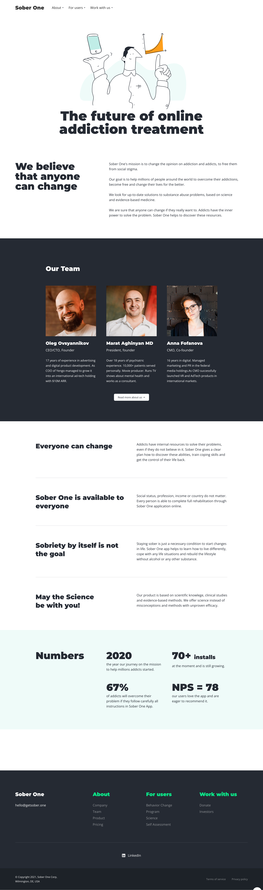

# Getsober.one

Landing website for my own startup Sober One — a mobile app for addicts helping them to overcome addiction online.

## Jobs done

- Design
- Coding
- Copywriting

## Tech Stack

- HTML: Structure of the web page.
- CSS: Styling and layout.
- JavaScript: Interactivity and dynamic content.

## Home Page

## Company Page

## Product Page

