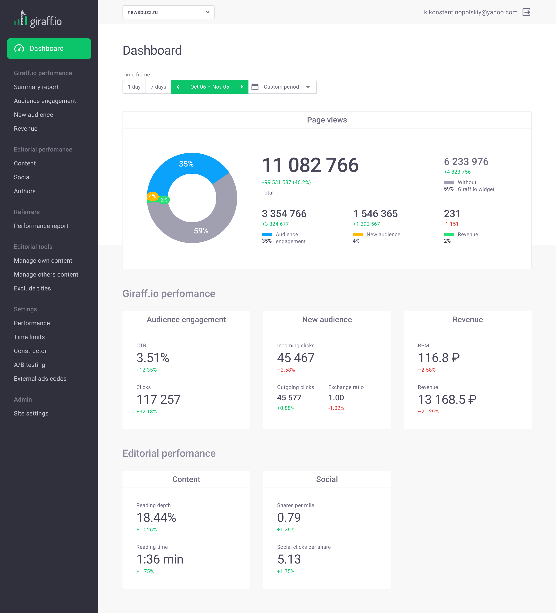
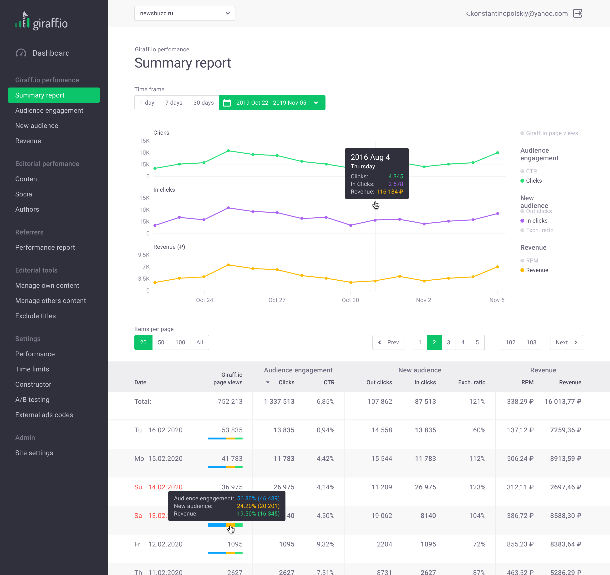
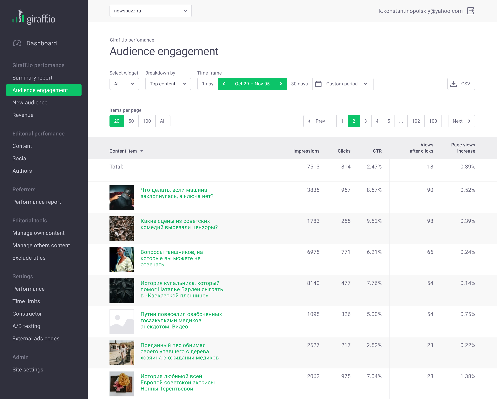
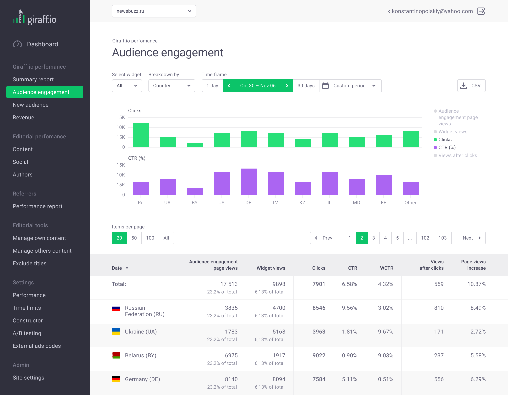
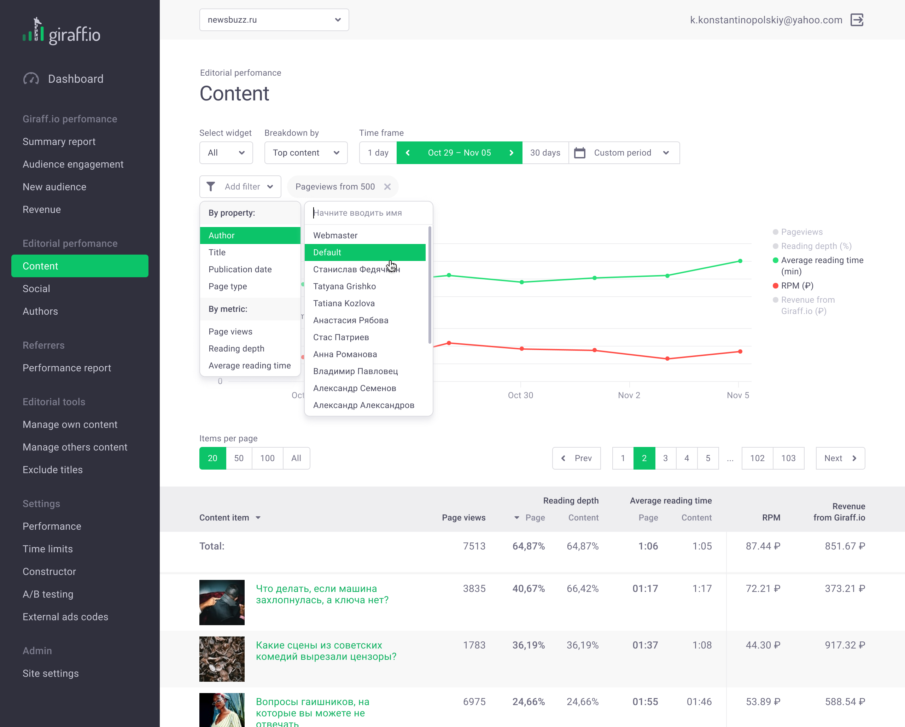
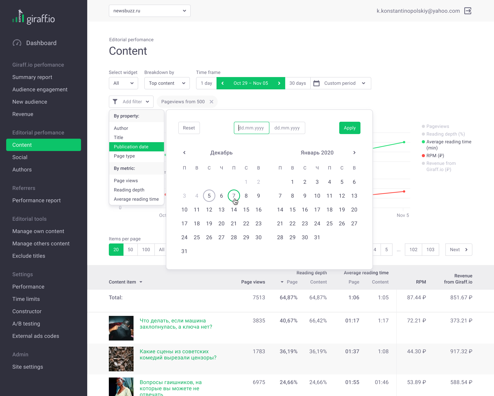
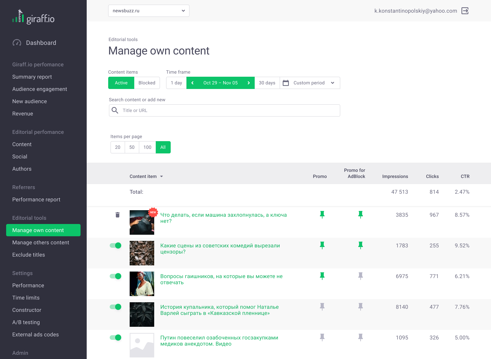

# Giraff for Publishers Dashboard

As the project leader, I oversaw the design development and wrote front-end code for a service that provides content recommendations and monetization for publishers. The main challenge was to create numerous pages and components while keeping the code structured, clean, and reusable.

## Jobs Done

- UX/UI design
- Frontend development
- UX copywriting

## Tech Stack

- Figma
- React.js
- Next.js
- Tailwind CSS
- TypeScript
- REST API

## Screens Preview

