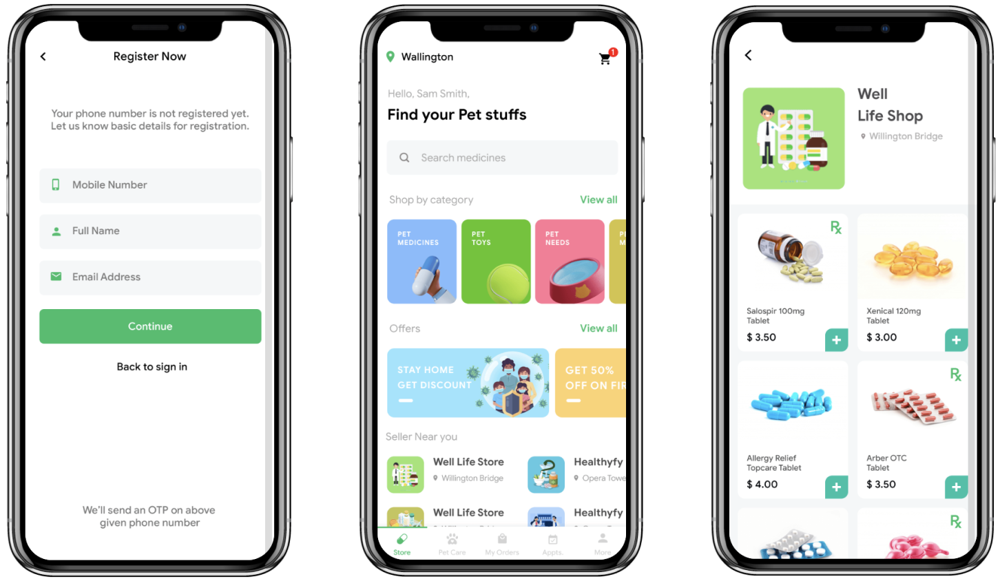
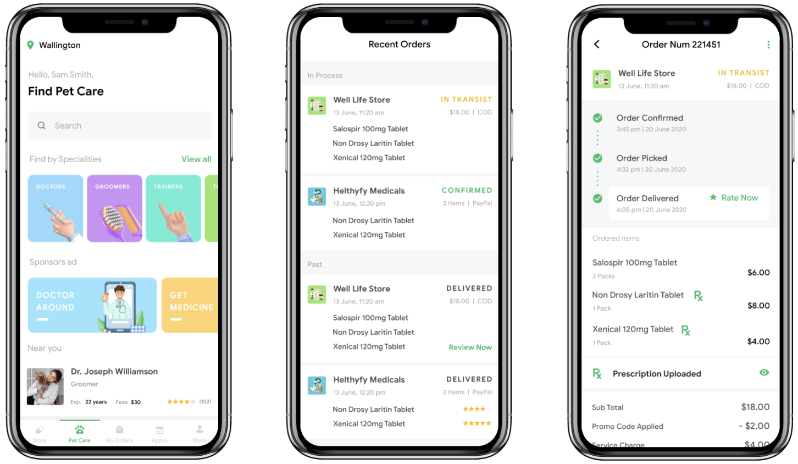
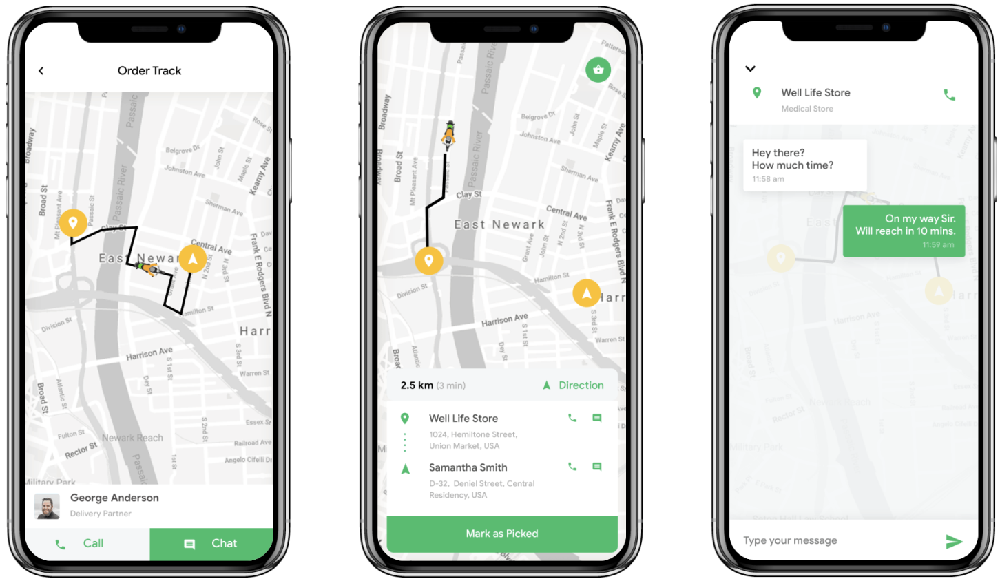

# Pet Care App

My goal was to create a mobile application to aid pet owners in caring for their pets. I designed over 30 screens to cover all necessary business procedures, using FlutterFlow for both design and implementation to produce streamlined and concise Flutter code.

This was a challenging task that involved developing various custom widgets and Flutter code backed up with Firebase as a backend.

The resulting cross-platform application functioned flawlessly on iOS, Android, and the Web. Unfortunately I can't provide production link cause this startup is closed already.

## Jobs Done

- Design
- FlutterFlow cross-platform implementation
- ustom widgets and code development
- Firebase backend development

## Tech Stack

- Figma
- FlutterFlow
- Flutter / Dart
- Firebase / Firestore / Cloud Functions

## Screens Examples

### Pet owners can find and buy various products and services

### Every order is tracked in detail

### Delivery service with real-time tracking feature

