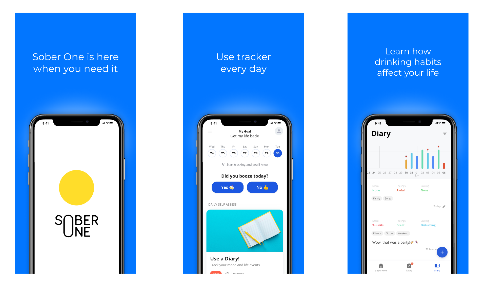
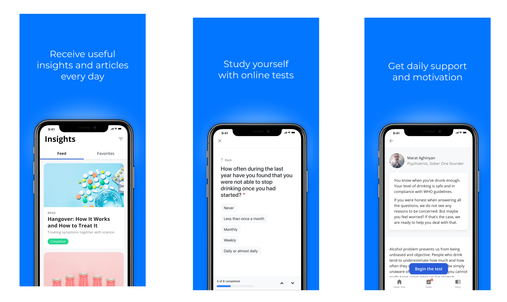

# Sober One App

Segments from a digital mental health application designed to provide support across multiple platforms.

## Jobs done

- Design creation
- Frontend development
- Backend development [(link)](../api/)
- UX copywriting

## Technologies

- React.js: For building the interface.
- Redux: For comprehensive state management.
- Ionic Framework: For cross-platform app development.
- Capacitor: For native runtime and web app services.

## App Previews

